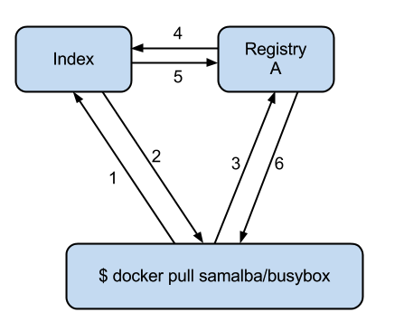

# Docker入门与实践

Lesson-05 构建私有镜像服务器
刘斌@OneAPM
2015年8月

# 本节概要

- 什么是Registry和Index
- 部署私有Registry
- 集成Portus进行用户认证

# 什么是Registry和Index

- 保存镜像层以及meta信息
- 用户认证，UI等Web接口

# Registry

- 存储镜像
- 控制自己的部署pipeline
- 
integrate image storage and distribution tightly into your in-house development workflow

# Docker Distribution

- 打包、传输、存储、交付内容的工具集
- 以Registyry 2.0为主要产品
- 还包括docs.docker.com的所有文档

# Use cases

- CI/CD
- 大规模部署
- 异地部署

# 安装

- Docker style
- docker run -d -p 5000:5000 registry:2
- 简单的难以置信
- 软件交付方式
- no wget && tar && pip install

# 使用私有Registry

- docker tag
- docker push/pull

# 使用私有Registry

```bash
# docker tag centos:7 myregistry.com:5000/centos:7
# docker push myregistry.com:5000/centos:7
```

# 查看Registry内部

```bash
$ sudo docker exec -it registry bash
cd /tmp
```

# 演示

- 启动Registry
- 向Registry push镜像


# Storage Driver

- 存储本身交给Storage Driver
- 默认为本地文件系统，适合开发或者小规模
- 也可以使用云存储，如S3、Azure和Ceph等，以及阿里云OSS
- 甚至通过实现Storage API自定义storage backend


# 将数据保存到Volume

- -e REGISTRY_STORAGE_FILESYSTEM_ROOTDIRECTORY=/var/lib/registry
- -v /myregistrydata:/var/lib/registry


# 数据存储到Volume

```bash
$ docker run -d -p 5000:5000 \
  -e REGISTRY_STORAGE_FILESYSTEM_ROOTDIRECTORY=/var/lib/registry \
  -v /myregistrydata:/var/lib/registry \
  --restart=always --name registry registry:2
```

# Notification机制

- webhooks/notification
- log和report
- email/bugsnap/newrelic

# 安全对策

- 支持TLS
- 通过Nginx等进行basic authentication
- 官方文档也有其他方式的认证和授权实现说明

# 在公共网络上使用

- 非localhost
- 买一个证书（推荐）
- 配置--insecure-registry
- 自签名证书
- 防火墙

# 认证（Authentication）

- docker login



# 认证

- Basic（Proxy）认证
- Token 认证（delegated authentication）

# Basic（Proxy）认证

- 简单
- 准备证书
- 创建用户密码

# Token认证

- 需要实现
- 复杂、大型组织

# Portus

- 开源：MariaDB + Rails + Registry

# 课后作业

- 运行自己的私有Registry
- 构建一个镜像并push到该Registry
- 在本地删除该镜像
- 从私有镜像pull出来
