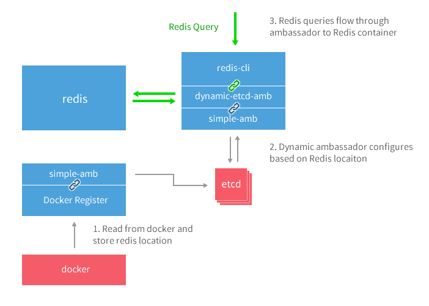

# Docker入门与实践

Lesson-07 Docker Link
刘斌@OneAPM
2015年8月

# 本节概要

- 什么是Docker Linxk
- Docker Link的功能
- Docker Link的用法

# 为什么需要Docker Link

- 如何连接到Docker容器？
- docker inspect
- docker port

# 命名的重要性

- happy_newton
- 容易理解

- --name选项
- 唯一

# Docker Link的好处

- 方便引用
- 类似白名单
- 安全：只有引用者才能访问端口

# 第一个Docker Link

```bash
docker run -d --name db training/postgres
docker run -d -P --name web --link db:db training/webapp python app.py
docker inspect -f "{{ .HostConfig.Links }}" web

```

# 目的容器如何认识源容器？

- 环境变量
- /etc/hosts文件

# 环境变量来自哪里？

- Dockerfile
- docker run -e|-env-file 选项

# Docker Link添加的环境变量

- 根据--link参数别名创建
- 来自源容器（此处有安全隐患）

# Docker Link添加的环境变量

- <alias>_NAME
- /<source_container>/<alias>

# 和端口相关的环境变量

- <alias>_PORT： WEBDB_PORT=tcp://172.17.0.82:8080
- prefix： <name>_PORT_<port>_<protocol>
- prefix_ADDR： WEBDB_PORT_8080_TCP_ADDR = 172.17.0.82
- prefix_PORT： WEBDB_PORT_8080_TCP_PORT = 8080
- prefix_PROTO： WEBDB_PORT_8080_TCP_PROTO = tcp
- 环境变量数量 = n（port num） * 3

# 源容器的其他环境变量

- 全部
- <alias>_ENV_<name>

# 更新/etc/hosts

- 在目标容器的/etc/hosts中，增加源容器条目

# 更新/etc/hosts

```bash
$ docker run -t -i --rm --link db:webdb training/webapp /bin/bash
root@aed84ee21bde:/opt/webapp# cat /etc/hosts
172.17.0.7  aed84ee21bde
. . .
172.17.0.5  webdb 6e5cdeb2d300 db

```

# /etc/hosts自动更新

- 源容器重启后，会自动更新/etc/hosts条目
- 环境变量不会更新
- 建议使用/etc/hosts

# 大使（ambassador）模式

- 从 (consumer) --> (redis)
- 到 (consumer) --> (redis-ambassador) --> (redis)
- 或 (consumer) --> (redis-ambassador) ---network---> (redis-ambassador) --> (redis)
- 解决跨主机通信


# svendowideit/ambassador容器

- socat
- Docker Hub不活跃

# 基于etcd的大使模式



图片来源：https://coreos.com/assets/images/media/etcd-ambassador-flow.png


# 课后作业

- 在两个容器中使用link
- 在目的容器中检查ENV，/etc/hosts等
- 确认网络连通性

