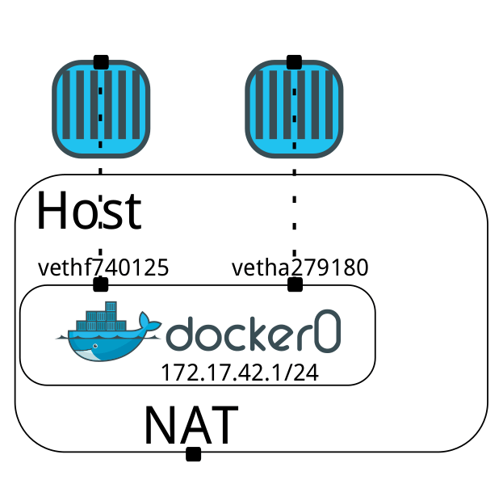
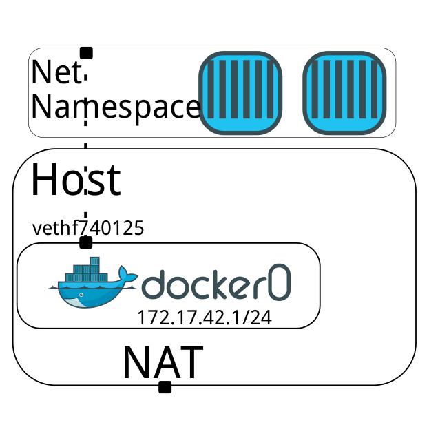
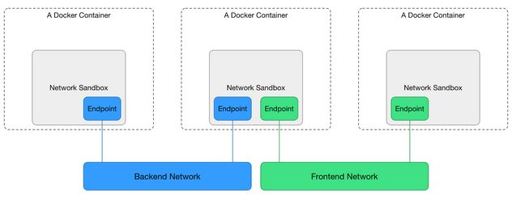
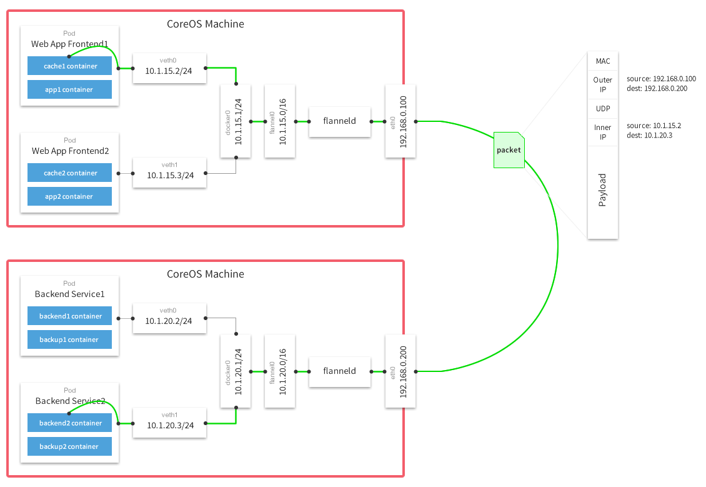

# Docker入门与实践

Lesson-12 Docker网络
刘斌@OneAPM
2015年8月

# 本节概要

- Linux网络基础
- iptables基础知识
- Docker的网络实现原理
- Docker和网络相关的参数和配置bash
- 对Docker进行简单的网络定制
- 一些网络解决方案（SDN）

# Linux 网络设备

- eth0
- lo
- ip命令

# Linux网络文件说明

- /etc/hostname
- /etc/hosts
- /etc/resolv.conf

# 演示1

- 在容器内
- ip addr show
- 查看/etc/hostname
- /etc/hosts
- /etc/resolv.conf


# iptables基础知识

- 防火墙
- NAT

# iptables的4个表

- filter
- nat
- mangle
- raw

# iptables的4个表

```bash
$ sudo iptables -t filter -L
```

# Docker中的网络

- Network NS
- iptables
- 网桥

# docker0网桥

- 172.17.42.1/16
- 16bit的网络，有65534个地址可用
- 连接host和所有容器的虚拟子网

# Docker容器运行的4种网络模式

- bridge
- host
- 容器
- overlay（实验版）
- none

# bridge模式

- --net=bridge
- 默认模式。172段IP地址。



图片来源：http://blog.midonet.org/docker-networking-midonet/

# host

- --net=host
- 共享主机IP地址、网卡设备、主机名等。

# 容器模式

- --net=container:(id/name)
- 共享其他容器网络环境



图片来源：http://blog.midonet.org/docker-networking-midonet/

# none无网络模式

- --net=none
- 容器启动时，无任何网络。
- 可手工配，适用于需要对网络结构进行特殊定制的情形。

# docker run 参数

- docker run -h hostname
- --dns-search=192.168.10.100
- docker run -d -p 8080:8080


# -p和-P参数

- -P 随机分配宿主机端口，49000~49900
- -p 详细配置端口映射
- - 8080:80
- 127.0.0.1:8080:80
- 127.0.0.1::80

# docker port查看端口映射

- docker port 80

# 和网络相关的命令行参数

- 只能在daemon中使用
- 只能在client中使用
- 在daemon和client中都能使用

# 只能在daemon中使用的参数

- -b BRIDGE or --bridge=BRIDGE
- --bip=CIDR
- --default-gateway=IP_ADDRESS
- --fixed-cidr
- --default-gateway-v6=IP_ADDRESS

- -H SOCKET... or --host=SOCKET... daemon监听接口
- --icc=true|false
- --ip=IP_ADDRESS
- --ip-forward=true|false

- --iptables=true|false
- --mtu=BYTES
--userland-proxy=true|false

# 只能在docker run中使用

- -h HOSTNAME or --hostname=HOSTNAME
- --link=CONTAINER_NAME_or_ID:ALIAS
- --net=bridge|none|container:NAME_or_ID|host
- --mac-address=MACADDRESS...
- -p SPEC or --publish=SPEC
- -P or --publish-all=true|false


# 在client和daemon都能使用

- --dns=IP_ADDRESS
- --dns-search=DOMAIN


# /etc下的三个关键文件

```bash
mount | grep /etc

/dev/vda1 on /etc/resolv.conf type ext4 (rw,relatime,data=ordered)
/dev/vda1 on /etc/hostname type ext4 (rw,relatime,data=ordered)
/dev/vda1 on /etc/hosts type ext4 (rw,relatime,data=ordered)
```

# hostname和hosts

- -h HOSTNAME or --hostname=HOSTNAME
- /etc/hostname
- /etc/hosts
- shell提示符

# hostname和hosts

- --link=CONTAINER_NAME_or_ID:ALIAS
- /etc/hosts 中添加  ALIAS
- ALIAS重启后，自动更新/etc/hosts

# resolv.conf

- --dns=IP_ADDRESS... 
- /etc/resolv.conf添加server行
- --dns-search=DOMAIN... 
- 在/etc/resolv.conf添加search行

# 容器通信

- 容器之间
- 容器访问外部
- 外部访问容器

# 容器和外部通信

- host是否允许包转发
- iptables是否允许容器间连接

# host上的包转发

- ip_forward ，设置1时容器间可以通信
- --ip-forward=true一样效果

# host上的包转发

```bash
# sysctl net.ipv4.conf.all.forwarding=1
# sysctl net.ipv4.conf.all.forwarding
net.ipv4.conf.all.forwarding = 1
```

# Docker iptables设置

- --iptables=false，Docker不会进行iptables设置
- 默认会在DOCKER过滤链中添加规则

# 容器间通信

- 网络拓扑结构上是否能互通
- iptables是否允许（--icc=true）
- 在FORWARD链添加ACCEPT策略
- --icc=false. 则为DROP

# icc=false时容器如何互连？

- --icc=true，安全性问题
- 使用link可以解决
- --icc=false 并且 --iptables=true 

# 外部如何连接到容器？

- iptables masquerade 规则
- 运行容器访问外部世界

# 外部如何连接到容器？

```bash
iptables -t nat -L -n
Chain POSTROUTING (policy ACCEPT)
target     prot opt source               destination
MASQUERADE  all  --  172.17.0.0/16        0.0.0.0/0
```

# 外部如何连接到容器？

- 使用-P或者--publish-all=true，EXPOSE所有Dockerfile里的端口
- --expose <端口号>
- 映射到host端口上
- host端口范围由/proc/sys/net/ipv4/ip_local_port_range 控制
- 一般为 32768 to 61000

# -p和-P的区别

- -p 小p是精确映射
- -P expose出全部镜像定义的端口


# -P（大P）时iptables规则

```bash
iptables -t nat -L -n
Chain DOCKER (2 references)
target     prot opt source               destination
DNAT       tcp  --  0.0.0.0/0            0.0.0.0/0            tcp dpt:49153 to:172.17.0.2:80
```

# -p（小p）时iptables规则

```bash
Chain DOCKER (2 references)
target     prot opt source               destination
DNAT       tcp  --  0.0.0.0/0            0.0.0.0/0            tcp dpt:80 to:172.17.0.2:80
```

# 定制docker0

- --bip=CIDR —docker0网桥IP地址，CIDR格式，如192.168.1.5/24
- --fixed-cidr=CIDR—IP范围  docker0子网,  like 172.167.1.0/28
- --mtu=BYTES  docker0的最大传输单元大小


# 容器启动时所做的网络工作

- 在host中创建虚拟设备对vethXXXX
- 将vethXXXX绑定到docker0网桥
- 将设备对的另一端放入容器，命名为eth0
- 独立网络namespace，不用担心各种冲突
- 为eth0设置mac（用户可指定）和IP地址（不能指定）
- 默认路由为docker0网桥的IP地址

# 模拟Docker网络设置过程

- 实验演示
- 模拟Docker为容器创建网络设备

# 创建点对点连接

- 虚拟设备对从host-container到container-container
- 配置为点对点连接
- 可和其他网络模式并用

# 然而需求源源不断

- IP重用
- 任意指定IP
- 跨主机通信
- 从外部直接访问容器网路
- L2/L3跨主机虚拟网络


# pipework

- Jérôme Petazzoni，Docker公司布道师
- https://github.com/jpetazzo/pipework
- ip/brctl/ovs-vsctl
- VLAN/macvlan/Open vSwitch
- DHCP

# 修改容器内网络配置文件

- /etc/hosts,/etc/hostname,/etc/resolve.conf
- 只能在running的容器中
- docker commit 不能保存
- docker restart 也会丢失

# libnetwork

- SocketPlane
- 2015.3被Docker inc.收购
- Multi-Host Container Networking


# libnetwork

- 跨平台的容器网络库
- libcontainer的网络版
- 轻量、高模块化、可组装、独立工作的工具
- “batteries included but swappable”


# CNM组件

- Container Network Model (CNM)实现
- Sandbox（网络栈配置，Linux Network NS ）
- Endpoint（将Sandbox连接到Network，veth）
- Network（一组可以互相通信的Endpoint，Linux网桥/VLAN）

# CNM组件



# CNM对象（Objects）

- NetworkController
- Driver
- Network
- Endpoint（Service Endpoint）
- Sandbox

# Drivers

- null
- bridge
- overlay（实验版experimental）
- remote

# 第三方网络解决方案

- weave
- flannel
- Calico
- Triton

# weave

- Weaveworks开发
- 高效的连接、监视和控制Docker容器的方式

# weave

- virtual network
- 跨主机、自动发现
- 不需要配置link，端口映射等
- 轻松对外发布weave network上的服务


# flannel

- CoreOS开发
- 基于etcd的容器网络编配
- Agent： flanneld

# flannel



# flannel Backends

- udp
- vxlan
- host-gw
- aws-vpc
- gce
- alloc


# 课后作业

- 练习iptables命令
- 使用--net=host启动容器，查看网络配置
- 使用--net=container启动容器，查看网络配置
- 使用--net=none，手工为容器配置网络