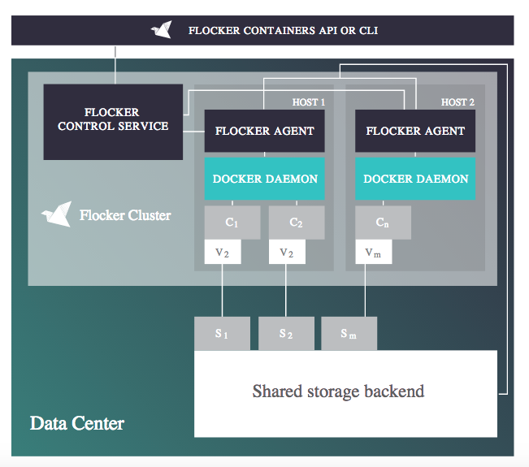
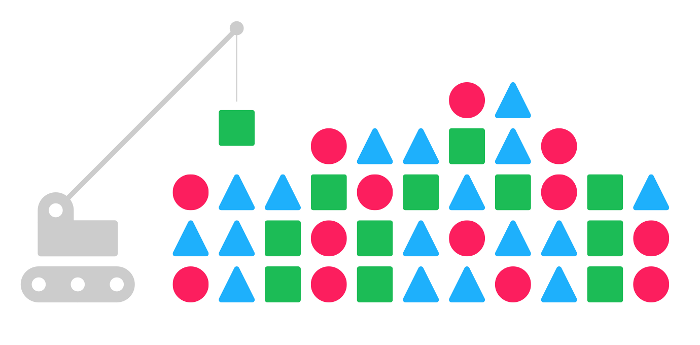
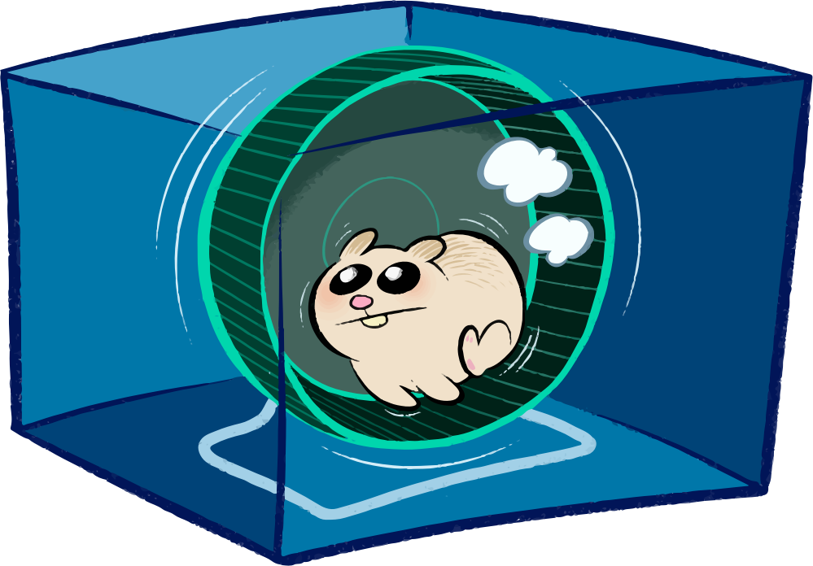

# Docker入门与实践

Lesson-15 延伸阅读
刘斌@OneAPM
2015年8月

# 本节概要

- 总结本系列课程
- Docker的扩展知识
- Docker的生态环境

# 四大问题

- 存储
- 网络
- 编配（集群管理）
- 工作流

# 解决方式

- Docker自身的进化
- 生态系统
- 软件架构、工作流的进化

# Docker产品

- 编排
- DevOps

# 生态系统

- There is no platform without ecosystem.
- by Solomon Hykes @DockerCon2015

# 存储

- Flocker

# PaaS

- Dokku
- Deis
- Flynn

# Deis

# 编排

- Mesos
- Kubernetes

# 管理界面

- docker-ui
- openstack horizon
- shipyard
- Portus

# 配置管理

- chef
- puppet
- salt
- Ansible

# CI

- jenkins
- drone
- strider
- travis

# 容器OS

- CoreOS
- Project Atomic
- Hyper
- http://rancher.com/

# rkt（Rocket）

- App Container runtime for Linux
- CoreOS主导开发
- "rock-it"

# rkt特点

- 没有daemon和Registry
- 深度集成init（systemd，upstart）
- 编配工具（fleet，k8s）
- 兼容Docker镜像
- 模块化、可扩展

# LXD

- Canonical 主导
- 基于LXC，有daemon，REST API
- lxc为客户端
- OpenStack Nova plugin (nova-compute-lxd)
- live migration

# 开放容器组织

- OCI（ Open Container Initiative， https://www.opencontainers.org/ ）
- RunC（ http://runc.io/ ）

# RunC

- Runtime
- 基于libcontainer
- 没有Daemon
- 没有镜像管理但兼容Docker镜像

